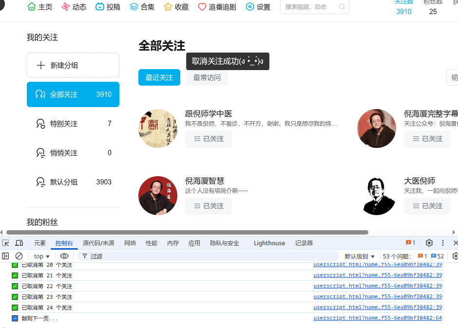

# Bilibili 批量取关脚本

## 🧩 简介

这是一个适用于 B 站用户空间「关注列表」页面的油猴脚本，用于批量取消已关注的 UP 主。支持自动翻页和操作延迟，帮助你快速清理关注列表。

---

## ⚙️ 使用方法 How to Use

1. 打开链接：https://space.bilibili.com/
2. 进入你的个人主页，点击「关注」进入关注列表页  
   页面地址应形如：

```
https://space.bilibili.com/你的UID/relation/follow
````

3. 安装并启用本脚本后，页面加载完成后将自动运行（默认延迟 3 秒开始）

---

## 🚀 脚本功能 Features

- ✅ 自动检测当前页已关注用户并逐一取关
- 🔁 支持自动翻页处理更多关注项（默认最多 100 页）
- ⏱️ 支持设置 hover 延迟、点击间隔与翻页等待
- ⚙️ 可通过代码顶部参数开关是否启用自动翻页

---

## 📌 补充说明

- Bilibili 当前关注上限为 **5000 个 UP 主**  
- 如果你已经接近上限，清理关注有助于恢复关注功能  
- **运行期间可能会弹出B站验证，属于正常行为**，请手动输入后继续执行  
- 所有操作为模拟用户点击

---

## 🖼️ 效果演示（自动取关中）



---

## 🛠️ 参数说明

脚本内可修改以下参数来自定义行为：

```js
const AUTO_NEXT = true;    // 是否自动翻页
const clickDelay = 300;    // 取关按钮点击间隔（毫秒）
const pageDelay = 2000;    // 翻页等待时间（毫秒）
const numPages = 100;      // 最大翻页数
````

---

## 📄 License

本项目基于 [GNU Affero General Public License v3.0 (AGPL-3.0)](https://www.gnu.org/licenses/agpl-3.0.html) 开源发布。
你可以自由修改和再发布此脚本，但必须保持相同许可证。